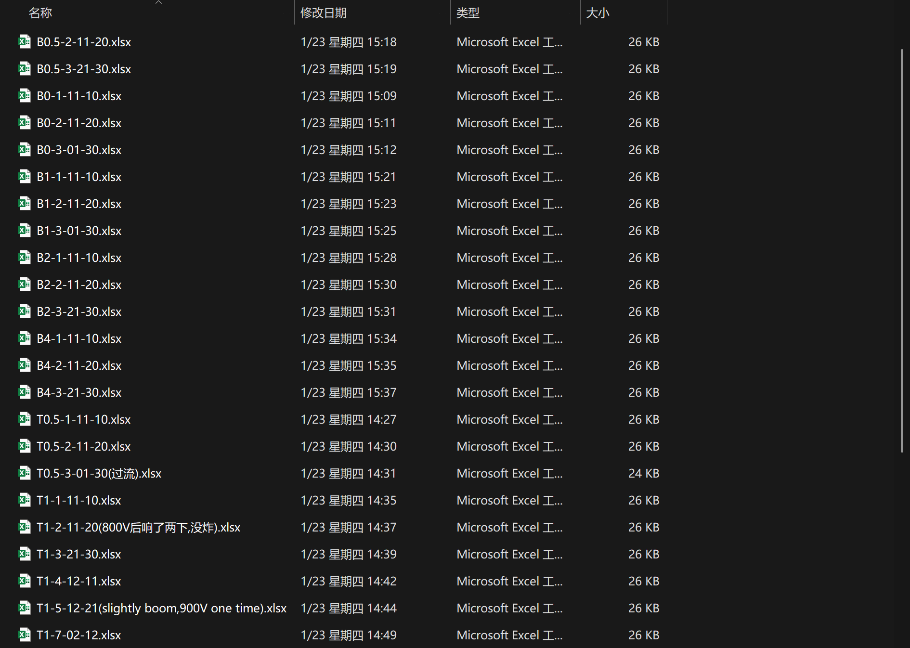
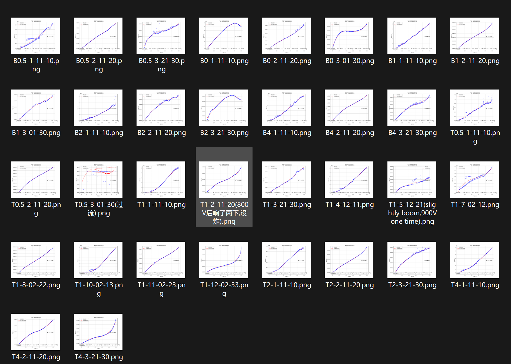
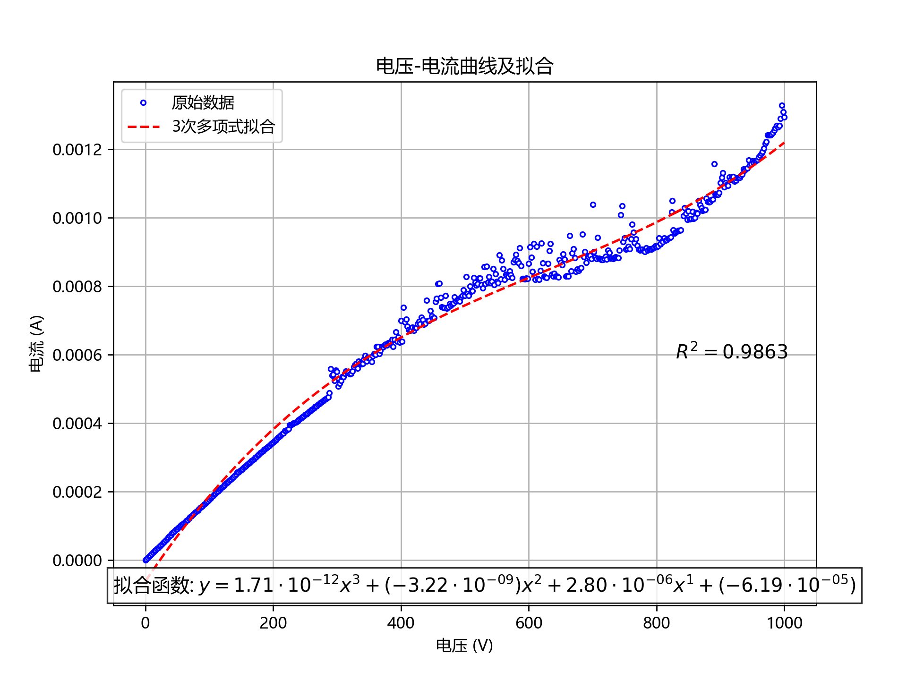

# 批量画图

## 功能解释

```python
batch_analyze_data('./datas_learn/old_34', './datas_learn/old_34/old34_img', line_style='--', line_color='r', connect_points=False)
```

- 将 old_34目录下的所有xlsx表格都读取
  - 并以原数据画图 ( connect_points=False表示不用线连接原数据点. 只在图中描点)
  - 图中附带多项式拟合曲线(line_style='--', line_color='r'表示拟合曲线为虚线,红色)
  - 并将所有图像存储于old_34文件夹中的old34_img中(程序会自动创建)

- `batch_analyze_data`函数中引用了函数`analyze_data_no_display`(no_display 后缀表示画图, 但不会弹出窗口让你看)
  - `analyze_data_no_display`函数是 读取原数据描点画图 + 根据数据进行多项式曲线拟合 的二合一包装
  - 注意: 该函数不能实现迭代拟合, 因为我初步考虑是, 这个画图阶段只是初步展示, 后续再加入迭代拟合
    - 简单的迭代拟合已经实现, 不过对于一些奇葩数据效果实在不好

## 效果展示

- 对于代码

```python
batch_analyze_data('./datas_learn/old_34', './datas_learn/old_34/old34_img', line_style='--', line_color='r', connect_points=False)
```

- 原数据(old_34文件夹)
  - 
- 运行程序后, old_34文件夹中的 old34_img文件夹:
  - 

- 单个图片展示:(dpi=240) --- 由于渲染pdf有宽度限制, 所以可能图片不是原始大小
  - 

## 全代码

```python
import os
import pandas as pd
import numpy as np
import matplotlib
import matplotlib.pyplot as plt


# 设置中文字体，解决字体显示问题
matplotlib.rcParams['font.sans-serif'] = ['Microsoft YaHei']  # 例如使用微软雅黑（SimHei）
matplotlib.rcParams['axes.unicode_minus'] = False  # 解决负号显示问题


def analyze_data_no_display(file_path, degree=3, show_equation=True, show_r_squared=True, line_style='-', line_color='b',
                           line_width=1.5, connect_points=True):
    """
    与 analyze_data 功能相同，但不显示图像。
    """
    # 读取 Excel 文件
    xls = pd.ExcelFile(file_path)
    df = xls.parse(sheet_name=0)

    # 提取 C35 到 D536 的数据 (假设列名在第 35 行开始)
    df_filtered = df.iloc[34:536, [2, 3]].dropna()  # 选择 C 和 D 列（0-based 索引）

    # 重新命名列名
    df_filtered.columns = ["电压 (V)", "电流 (A)"]

    # 转换数据为数值类型（防止字符串干扰）
    df_filtered = df_filtered.astype(float)

    # 提取自变量（电压）和因变量（电流）
    x = df_filtered["电压 (V)"]
    y = df_filtered["电流 (A)"]

    # 多项式拟合函数
    def polynomial_fit(x, y, degree=3):
        p = np.polyfit(x, y, degree)  # 拟合多项式
        poly = np.poly1d(p)
        y_fit = poly(x)
        return p, y_fit

    # 调用多项式拟合
    p, y_fit = polynomial_fit(x, y, degree)

    # 准备拟合函数的字符串表达式（优化科学计数法显示）
    equation_terms = []
    for i, coef in enumerate(p):
        power = degree - i
        # 将python中 "e数字" 的科学计数法格式更改为latex形式
        coef_str = f"{coef:.2e}".replace("e", "\\cdot10^{") + "}"
        # 处理负号和小数点
        if coef < 0:
            coef_str = f"({coef_str})"
        # 添加 x 的幂次
        if power == 0:
            term = coef_str
        else:
            term = f"{coef_str}x^{{{power}}}"
        equation_terms.append(term)# 使用 {{}} 包裹幂次 防止出现x^10的情况出现 (LaTex规范:x^{10})

    # 拼接拟合函数表达式
    equation_str = " + ".join(equation_terms)

    # 计算 R²（决定系数）
    ss_residual = np.sum((y - y_fit) ** 2)  # 残差平方和
    ss_total = np.sum((y - np.mean(y)) ** 2)  # 总平方和
    r_squared = 1 - (ss_residual / ss_total)

    # 绘制数据和拟合曲线
    plt.figure(figsize=(8, 6))

    # 设置原始数据点的样式和连接线的样式
    if connect_points:
        plt.plot(x, y, marker='o', linestyle='-', color='b', label="原始数据", markersize=3,
                 markerfacecolor='white', markeredgewidth=1, linewidth=2)  # 数据点为白色，线条粗细为2
    else:
        plt.plot(x, y, marker='o', linestyle='', color='b', label="原始数据", markersize=3,
                 markerfacecolor='white', markeredgewidth=1)  # 数据点为白色，不连接

    # 绘制拟合曲线
    plt.plot(x, y_fit, linestyle=line_style, color=line_color, label=f"{degree}次多项式拟合", linewidth=line_width)

    # 当 show_equation == True, 在图形中添加拟合函数的表达式（使用 LaTeX 样式）
    if show_equation:
        plt.text(0.0, 0.06, f"拟合函数: $y = {equation_str}$", transform=plt.gca().transAxes, fontsize=12,
                 verticalalignment='top', ha='left', bbox=dict(facecolor='white', alpha=0.8))

    # 当 show_r_squared == True, 在图形中添加 R² 值，使用 LaTeX 样式
    if show_r_squared:
        plt.text(0.8, 0.5, f"$R^2 = {r_squared:.4f}$", transform=plt.gca().transAxes, fontsize=12,
                 verticalalignment='top', ha='left')

    # 图表设置
    plt.xlabel("电压 (V)")
    plt.ylabel("电流 (A)")
    plt.title("电压-电流曲线及拟合")
    plt.legend()
    plt.grid(True)

    # 返回图像对象
    return plt.gcf()

def batch_analyze_data(folder_path, output_folder, degree=3, show_equation=True, show_r_squared=True, line_style='-', line_color='b',
                       line_width=1.5, connect_points=False):
    """
    批量处理文件夹中的 Excel 文件，进行多项式拟合并保存图像。

    参数：
    - folder_path: 包含 Excel 文件的文件夹路径。
    - output_folder: 保存图像的文件夹路径。
    - degree: 多项式拟合的次数，默认3。
    - show_equation: 是否在图中显示拟合函数表达式，默认显示。
    - show_r_squared: 是否显示决定系数R²，默认显示。
    - line_style: 曲线的线型，默认为 '-'（实线）。
    - line_color: 曲线的颜色，默认为 'b'（蓝色）。
    - line_width: 曲线的线宽，默认为 1.5。
    - connect_points: 是否连接原始数据点，默认不连接。
    """
    # 创建输出文件夹
    if not os.path.exists(output_folder):
        os.makedirs(output_folder)

    # 遍历文件夹中的所有 Excel 文件
    for file_name in os.listdir(folder_path):
        if file_name.endswith('.xlsx') or file_name.endswith('.xls'):
            file_path = os.path.join(folder_path, file_name)
            # 调用 analyze_data_no_display 函数生成图像
            fig = analyze_data_no_display(file_path, degree, show_equation, show_r_squared, line_style, line_color,
                                          line_width, connect_points)
            # 保存图像
            output_file_path = os.path.join(output_folder, f"{os.path.splitext(file_name)[0]}.png")
            fig.savefig(output_file_path, dpi=240)
            plt.close(fig)
            print(f"已保存图像: {output_file_path}")
    print('分析完成.')

# 示例调用
# batch_analyze_data('./datas', './datas/datas_img')

batch_analyze_data('./datas_learn/old_34', './datas_learn/old_34/old34_img', line_style='--', line_color='r', connect_points=False)


```

