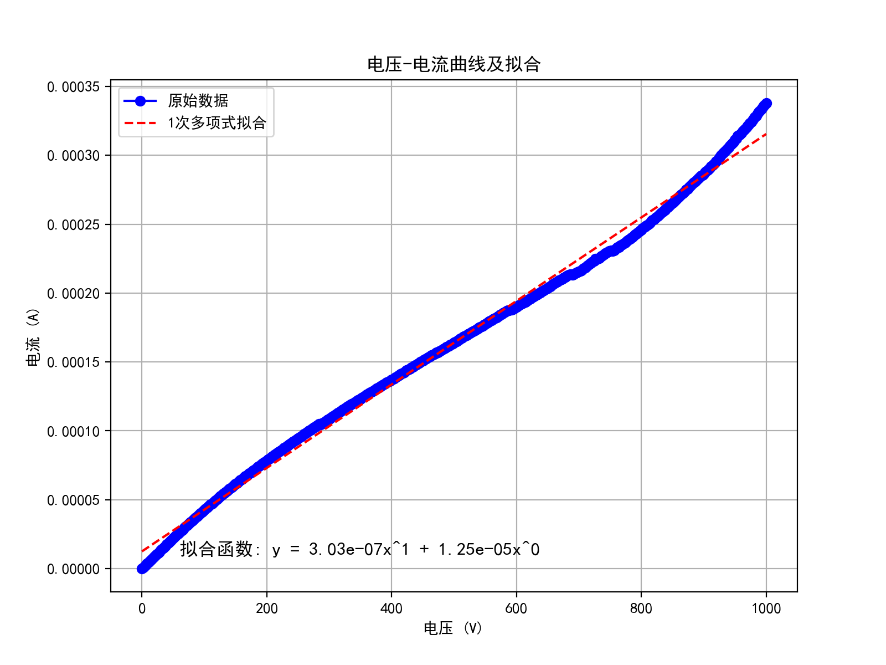
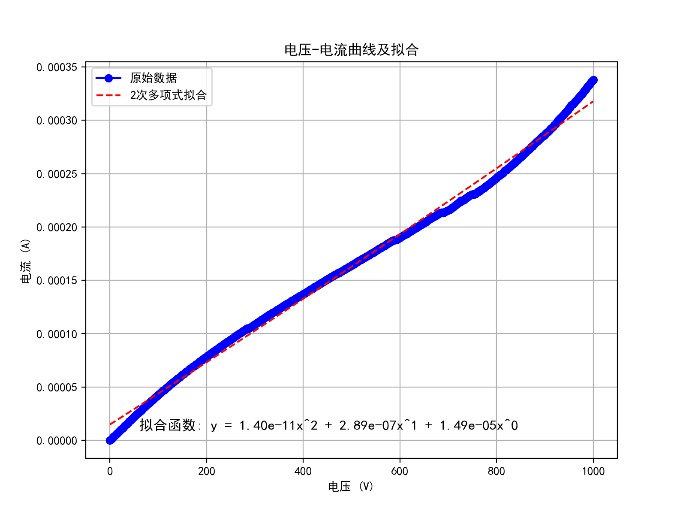
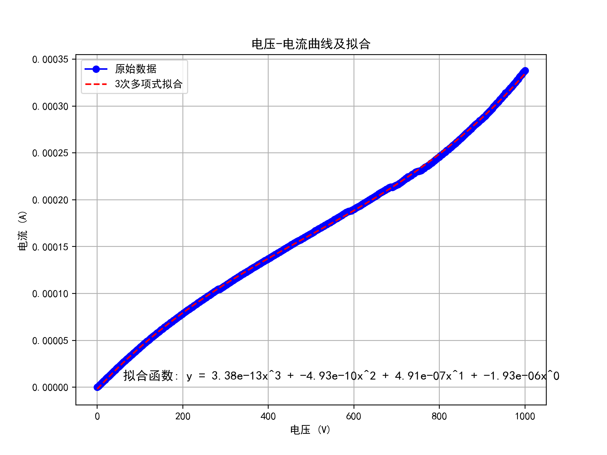
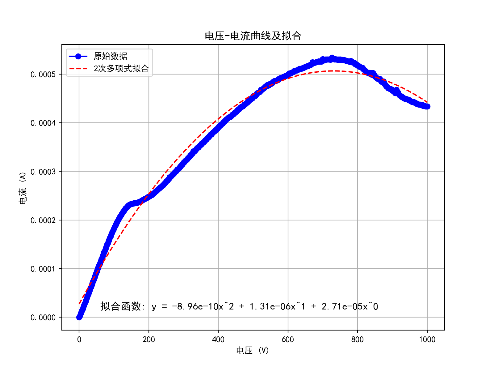
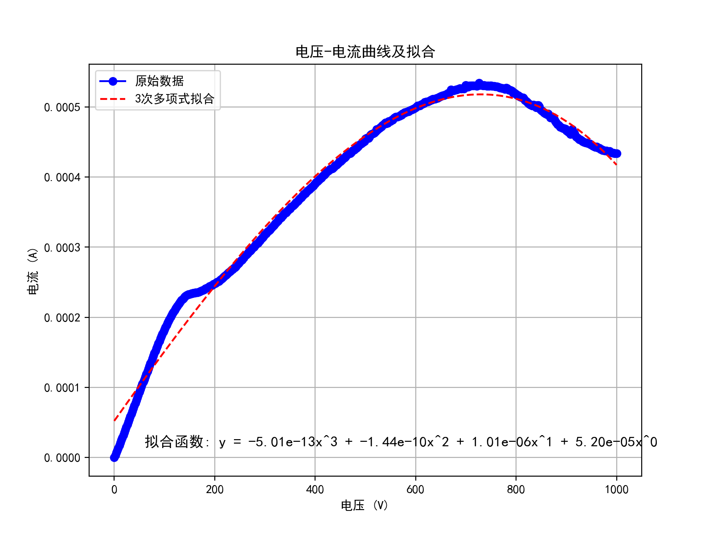
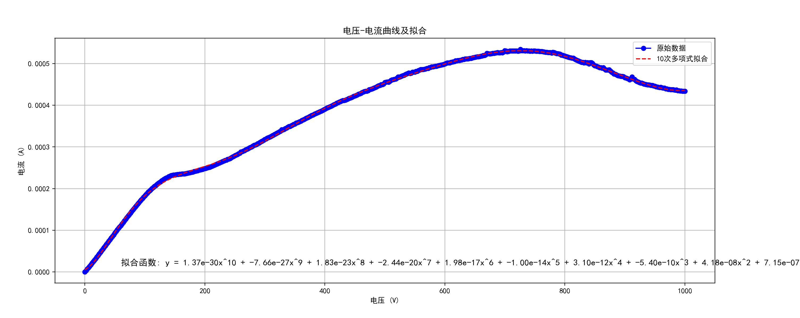

# 初步拟合结果(2025-2-5)

> 均基于2025-1-23日数据.

## 代码

```python
import pandas as pd
import matplotlib.pyplot as plt
import numpy as np

# 解决 Matplotlib 中文显示问题
import matplotlib
matplotlib.rcParams['font.sans-serif'] = ['SimHei']  # 例如使用黑体（SimHei）
matplotlib.rcParams['axes.unicode_minus'] = False  # 解决负号显示问题

# 读取 Excel 文件
file_path = "./datas_learn/B2-3-21-30.xlsx"  # 请确保该文件在当前目录
xls = pd.ExcelFile(file_path)

# 选择第一个 sheet
df = xls.parse(sheet_name=0)

# 提取 C35 到 D536 的数据 (假设列名在第 35 行开始)
df_filtered = df.iloc[34:536, [2, 3]].dropna()  # 选择 C 和 D 列（0-based 索引）

# 重新命名列名
df_filtered.columns = ["电压 (V)", "电流 (A)"]

# 转换数据为数值类型（防止字符串干扰）
df_filtered = df_filtered.astype(float)

# 提取自变量（电压）和因变量（电流）
x = df_filtered["电压 (V)"]
y = df_filtered["电流 (A)"]

# 多项式拟合函数
def polynomial_fit(x, y, degree=3):
    p = np.polyfit(x, y, degree)  # 拟合多项式
    poly = np.poly1d(p)
    y_fit = poly(x)
    return p, y_fit

# 调用多项式拟合
degree = 10  # 可以调整为你需要的拟合次数
p, y_fit = polynomial_fit(x, y, degree)

# 打印拟合的多项式系数
print(f"拟合多项式的系数（从高次到低次）: {p}")

# 准备拟合函数的字符串表达式
equation_str = " + ".join([f"{coef:.2e}x^{degree-i}" for i, coef in enumerate(p)])

# 绘制数据和拟合曲线
plt.figure(figsize=(8, 6))
plt.plot(x, y, marker='o', linestyle='-', color='b', label="原始数据")
plt.plot(x, y_fit, linestyle='--', color='r', label=f"{degree}次多项式拟合")

# 在图形中添加拟合函数的表达式
plt.text(0.1, 0.1, f"拟合函数: y = {equation_str}", transform=plt.gca().transAxes, fontsize=12, verticalalignment='top')

# 图表设置
plt.xlabel("电压 (V)")
plt.ylabel("电流 (A)")
plt.title("电压-电流曲线及拟合")
plt.legend()
plt.grid(True)

# 显示图像
plt.show()

```

## 拟合结果


### B1(忘了后面是什么了)

看起来比较线性

#### 1阶拟合



#### 2阶拟合



#### 3阶拟合(效果很好)



### B2-3-21-30

看起来像二次函数(至少不像一次)

#### 2阶拟合



#### 3阶拟合



##### 10阶拟合(效果好, 但也没啥用了)

任你奇形怪状, 阶数够高都能拟合



## 总结:

路还很长. 

大部分还是靠ai帮忙, deepseek经常崩还得跑去问gpt.

最抽象的是, 我前一天晚上写的代码, 今天居然运行出问题了... 过了一会儿又好了, 无大语


最棘手的:

1. 拟合方法不多
2. 要把我们考虑的参数放进去很困难
   1. 比如将天数, d, 辐照注量这些值量化
   2. 然后想办法放进去
   3. 这一点及其困难
   4. 但不做这一点, 那我们这个研究也就没啥特别实用的成果