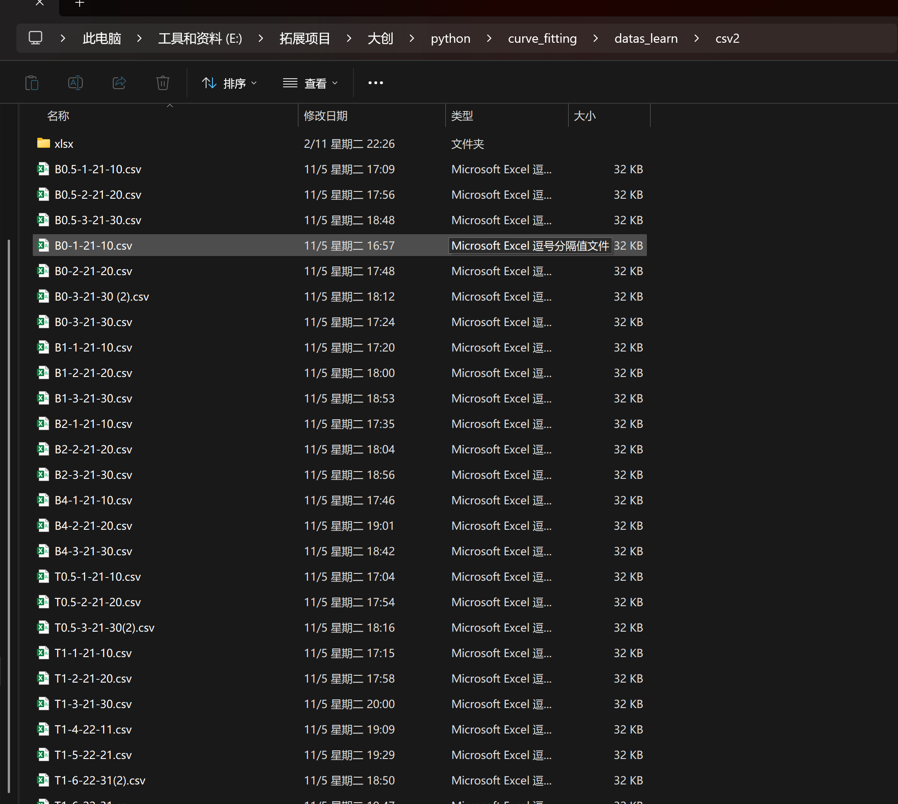
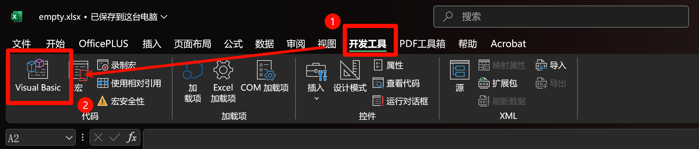
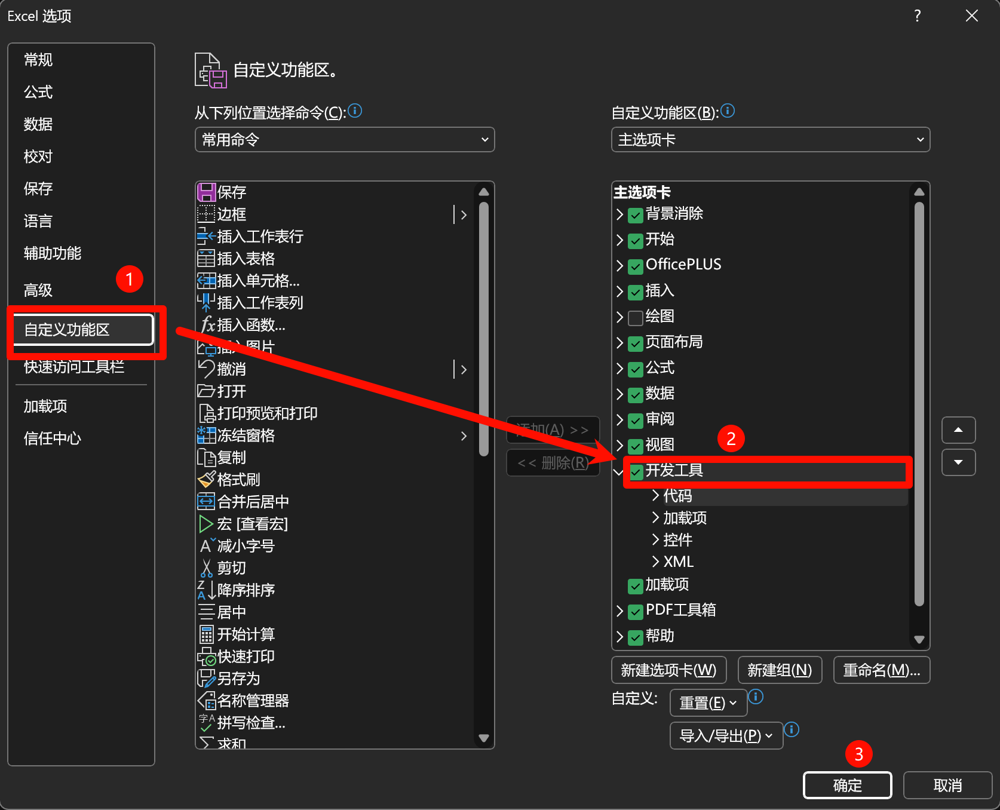
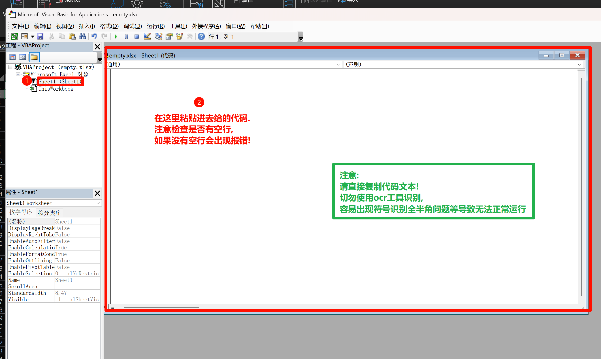
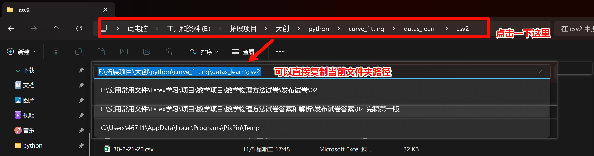
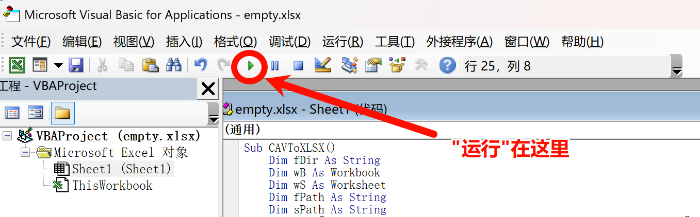

# .csv文件批量转换为.xlsx文件

> 摘自: https://zhuanlan.zhihu.com/p/597371609 

- 但请注意, 代码部分最好用下文中给的! 而不是上面链接的原代码(有细微差距, 文末有解释)

## 方法介绍

<font size=3>**第一步, 将需要转换的.csv放在一个文件夹中**</font>


- 注意:
  1. 不要存放除 .csv文件以外其他类型的文件 (并未测试是否会导致问题)
  2. 在目录中创建一个空文件夹, 预备存放转换后的 .xlsx文件

<div style="page-break-after: always;"></div>

<font size=3>**第二步, 在任意位置新建任意Excel工作簿, 并打开"开发工具"--"Visual Basic"**</font>



- 注意, 如果<u>没有找到"开发工具"</u>, 请点击“文件” 、点击“选项”、点击“自定义功能区”，勾选右侧“开发工具”前的小方框, 然后确定即可.

  

<div style="page-break-after: always;"></div>

<font size=3>**第三步, 点击左侧栏中sheet1(sheet1), 并在右侧空白区域粘贴代码**</font>

<font size=3 color=red>**(粘贴后请勿马上运行, 还要进行修改!)**</font>



- 代码如下:

```xlsx
Sub CAVToXLSX()
	Dim fDir As String
	Dim wB As Workbook
	Dim wS As Worksheet
	Dim fPath As String
	Dim sPath As String
	fPath = "C:\Users\Logistics-Ringchan\Downloads\2020_2022_DIVVY_CSV\"
	sPath = "C:\Users\Logistics-Ringchan\Downloads\xlsx _by_code\"
	fDir = Dir(fPath)
	Do While (fDir <> "")
		If Right(fDir, 4) = ".csv" Or Right(fDir, 5) = ".csv" Then
			On Error Resume Next
			Set wB = Workbooks.Open(fPath & fDir)
			'MsgBox (wB.Name)
			For Each wS In wB.Sheets
				wS.SaveAs sPath & Left(wB.Name, InStr(wB.Name, ".csv") - 1) & ".xlsx" _
				, FileFormat:=xlOpenXMLWorkbook, CreateBackup:=False
			Next wS
			wB.Close False
			Set wB = Nothing
		End If
		fDir = Dir
		On Error GoTo 0
	Loop
End Sub
```

- 修改内容:

  - 代码第 7 行, fpath 的路径是读取文件路径, 需修改为 .csv文件存放的文件夹路径

    - 以刚才的图片为例, 是E:\拓展项目\大创\python\curve_fitting\datas_learn\csv2

      
	
	  - 所以第 7 行代码应该修改为: 
	
	  - ```
	    fPath = "E:\拓展项目\大创\python\curve_fitting\datas_learn\csv2\"
	    ```
	
	    - 注意细节! 最后多了一个: <font color =red>\ </font> 这个不能省 !
	
	- 代码第 8 行, sPath的路径是保存文件路径, 需修改为转换后 .xlsx文件的目标存储路径
	
	  - 如果存放在刚才的 xlsx文件夹中, 就将第 8 行代码修改如下:
	
	  - ```
	    sPath = "E:\拓展项目\大创\python\curve_fitting\datas_learn\csv2\xlsx\"
	    ```

<font size=3>**第四步, 点击"运行", 耐心等待转换完成即可**</font>



- 运行后, 会有Excel工作簿闪出闪退, 这是正常现象, 表明代码正在运行. 
- 当闪烁现象结束后, 表明转换完成. 
- 建议到输出文件夹查验文件数量, 抽查文件内容.

<div style="page-break-after: always;"></div>

## 原理说明和部分补充

### 原理

- .csv文件在Excel中可以直接通过"另存为" 无损 转化为.xlsx文件.
  - 实测使用python转换会遇到各种各样的问题, 几乎会"全损"实验数据
  - 应该是可以代码实现的, 但其复杂度必然是比上述方法麻烦的
- 但当文件数量较多时, 逐个另存很繁琐
- 本代码的功能就是实现自动化"另存为"的功能, 类似于大家可能更熟悉的 "宏"

其他细节无需深究, 能用且不损失数据即可.

### 原作者强调

1. fPth = “C:…….<font color =red> \ </font>”是存放csv文件的文件夹位置，这些csv文件需要转换成xlsx工作簿格式；

2. sPath = “C:……<font color =red> \ </font>”是存放转换后得到的xlsx格式文件的文件夹位置。
   - 注意! 这个文件路径必须真的有文件夹!
   - python发现没有文件夹会自动帮你创建. 但xlsx不会!

3. 要根据自己电脑的文件路径自行修改，<font color =red>**最后的“\”不能丢掉**</font>。

4. 粘贴后点击"运行"(绿色三角形)，耐心等待，在xlsx文件中会一个一个出现转换后的EXCEL文件。

5. 这个代码相当于手动的打开-另存为的转换模式改为电脑自动运行。还是需要时间的，不是秒成。
   - 但比人工还是快多了! 

## 部分修改

- 最初版代码(点击文章开头链接可以看到)会将 a1.csv 转化为 a1.csv.xlsx , 多了个.csv在文件名中
  - 但根据知乎评论区大佬回答, 修改原代码中的 wB.Name 内容为如下内容: (已经修改)可以将后缀取消.

```xlsx
Left(wB.Name, InStr(wB.Name, ".csv") - 1)
```

- 实测成功.